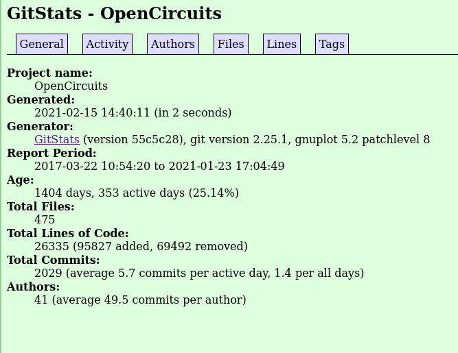
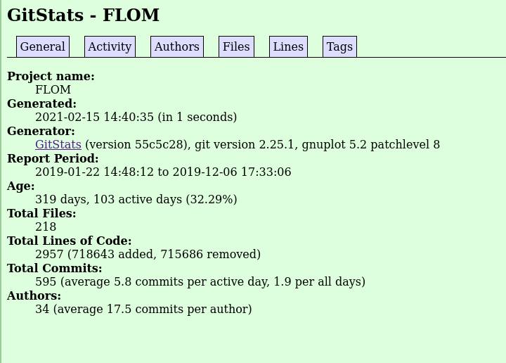
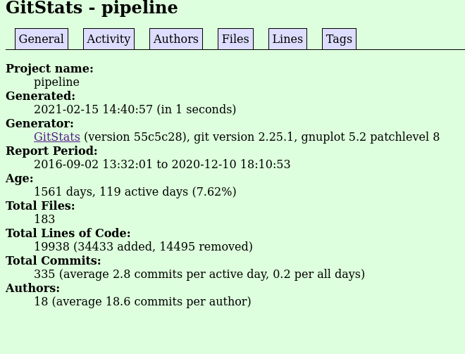
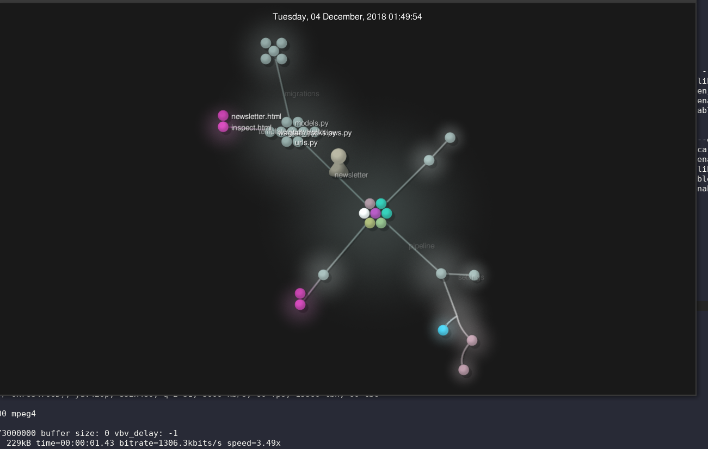
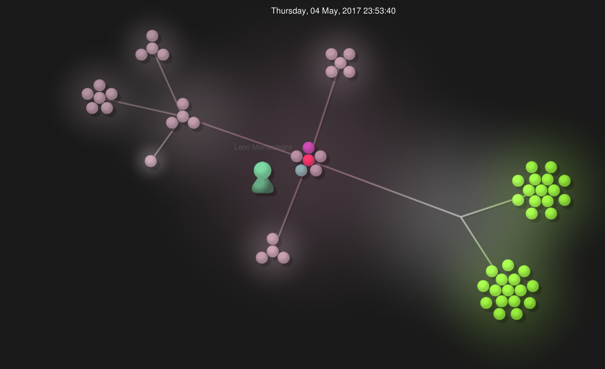
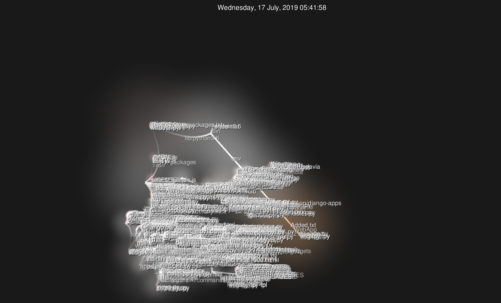
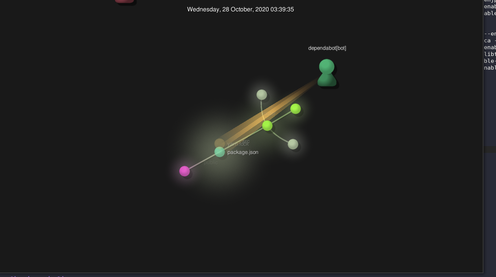

##### Part 1 - Documentation

https://github.com/seanpoh1/oss-repo-template/wiki

$$
\sqrt{1+2\sqrt{1+3\sqrt{1+4\sqrt{1+...}}}}
$$

$$
\sqrt{2}^{\sqrt{2}^{\sqrt{2}^{\sqrt{2}...}}}
$$

$$
\begin{bmatrix}
1 & 1 & 1 & 1 \\
-1 & 1 & -1 & 1 \\
-1 & -1 & 1 & 1 \\
1 & -1 & -1 & 1 \\
\end{bmatrix}
$$

##### Part 2 - Community

##### OpenCircuits

| Metric            |            |
| ----------------- | ---------- |
| Contributors      | 33         |
| Lines Of Code     | 2,796      |
| First Commit:     | 2017-03-22 |
| Latest Commit     | 2021-01-23 |
| Current branches: | 22         |

##### FLOM (Folsom Library Occupancy Monitor)

| Metric            |            |
| ----------------- | ---------- |
| Contributors      | 21         |
| Lines Of Code     | 16,071     |
| First Commit:     | 2019-01-22 |
| Latest Commit     | 2019-12-06 |
| Current branches: | 18         |

##### quacs

| Metric            |            |
| ----------------- | ---------- |
| Contributors      | 9          |
| Lines Of Code     | 20,862     |
| First Commit:     | 2020-02-25 |
| Latest Commit     | 2020-02-15 |
| Current branches: | 11         |

##### Pipeline

| Metric            |            |
| ----------------- | ---------- |
| Contributors      | 15         |
| Lines Of Code     | 21,509     |
| First Commit:     | 2016-09-02 |
| Latest Commit     | 2020-12-10 |
| Current branches: | 71         |

