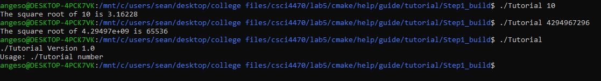
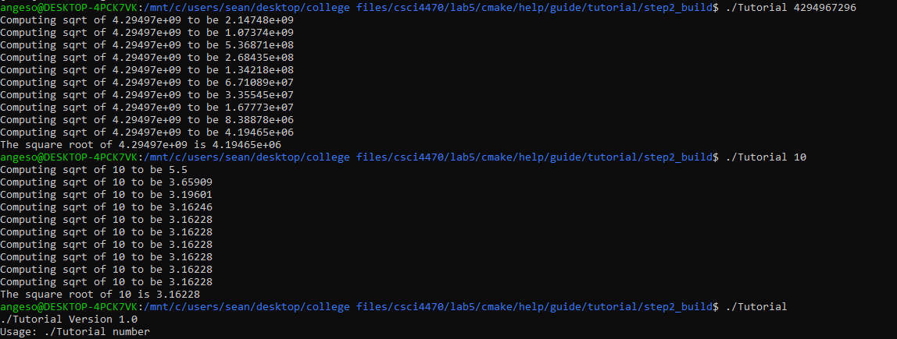
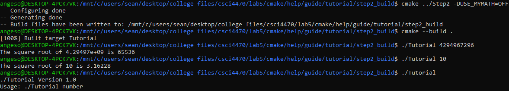
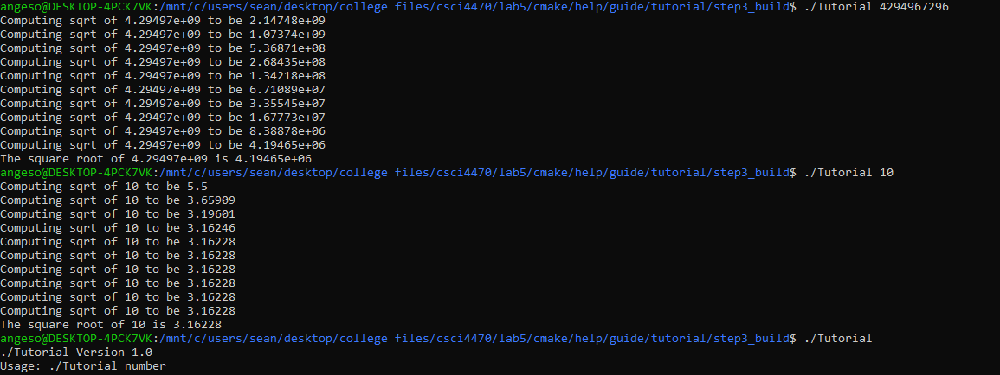
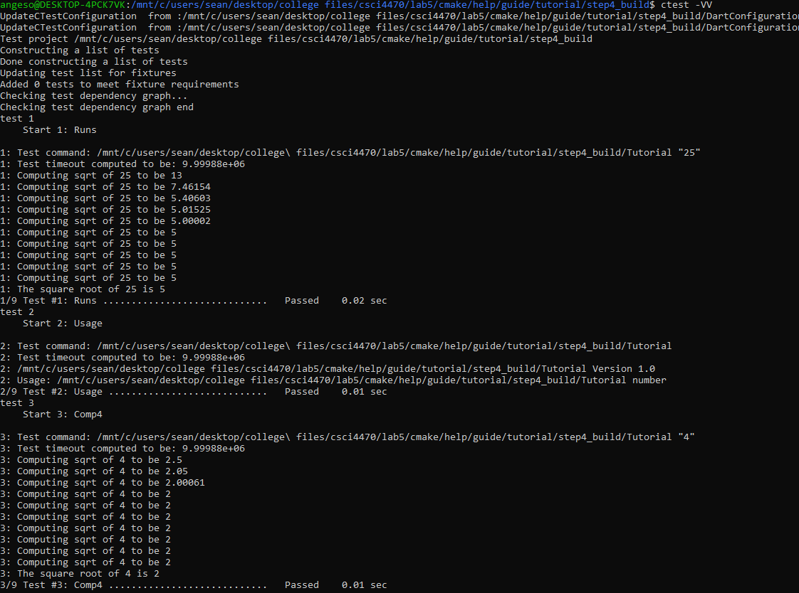
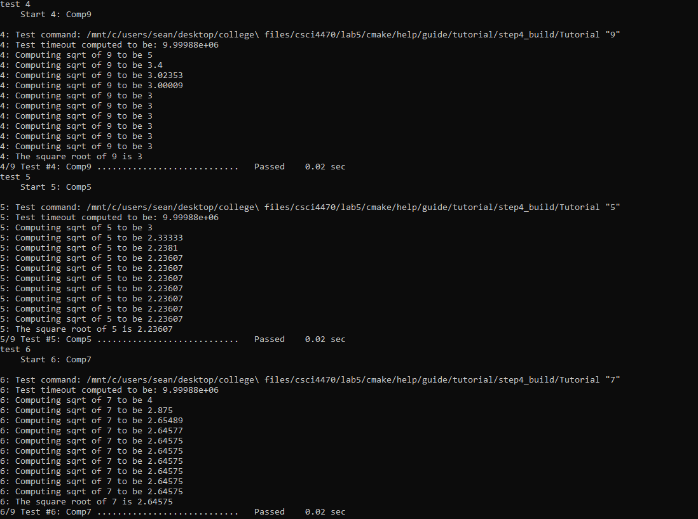
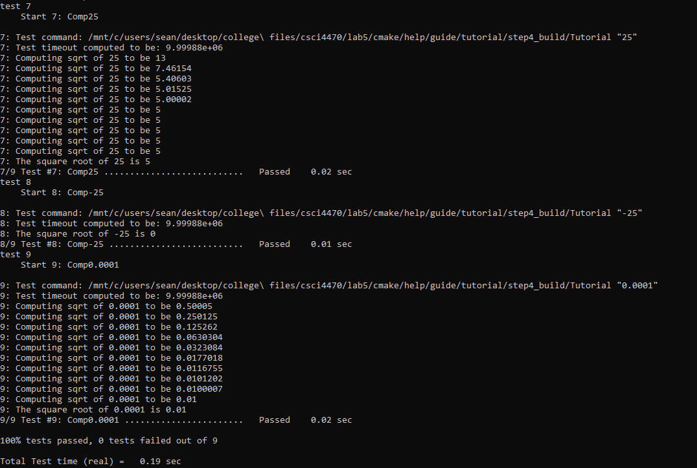
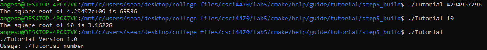
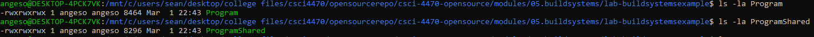
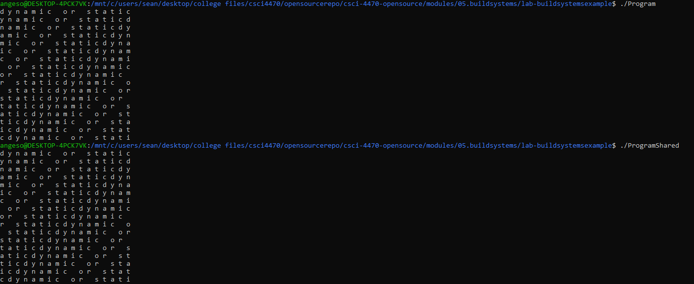

# Lab 5

### Part 1

#### Step 1

##### tutorial.cxx

```
// A simple program that computes the square root of a number
#include <cmath>
#include <iostream>
#include <string>
#include <TutorialConfig.h>

int main(int argc, char* argv[])
{
  if (argc < 2) {
    // report version
    std::cout << argv[0] << " Version " << Tutorial_VERSION_MAJOR << "."
              << Tutorial_VERSION_MINOR << std::endl;
    std::cout << "Usage: " << argv[0] << " number" << std::endl;
    return 1;
  }

  // convert input to double
  const double inputValue = std::stod(argv[1]);

  // calculate square root
  const double outputValue = sqrt(inputValue);
  std::cout << "The square root of " << inputValue << " is " << outputValue
            << std::endl;
  return 0;
}
```

##### CmakeLists.txt

```
cmake_minimum_required(VERSION 3.10)

# set the project name
project(Tutorial VERSION 1.0)

# add the executable
add_executable(Tutorial tutorial.cxx)

configure_file(TutorialConfig.h.in TutorialConfig.h)

target_include_directories(Tutorial PUBLIC
                           "${PROJECT_BINARY_DIR}"
                           )

set(CMAKE_CXX_STANDARD 11)
set(CMAKE_CXX_STANDARD_REQUIRED True)
```

##### Output




#### Step 2

##### tutorial.cxx

```
// A simple program that computes the square root of a number
#include <cmath>
#include <iostream>
#include <string>
#include "TutorialConfig.h"

#ifdef USE_MYMATH
#  include "MathFunctions.h"
#endif


int main(int argc, char* argv[])
{
  if (argc < 2) {
    // report version
    std::cout << argv[0] << " Version " << Tutorial_VERSION_MAJOR << "."
              << Tutorial_VERSION_MINOR << std::endl;
    std::cout << "Usage: " << argv[0] << " number" << std::endl;
    return 1;
  }


  // convert input to double
  const double inputValue = std::stod(argv[1]);

  // calculate square root
  #ifdef USE_MYMATH
    const double outputValue = mysqrt(inputValue);
  #else
    const double outputValue = sqrt(inputValue);
  #endif
  std::cout << "The square root of " << inputValue << " is " << outputValue
            << std::endl;
  return 0;
}
```

##### CMakeLists.txt

```
cmake_minimum_required(VERSION 3.10)

# set the project name and version
project(Tutorial VERSION 1.0)

# specify the C++ standard
set(CMAKE_CXX_STANDARD 11)
set(CMAKE_CXX_STANDARD_REQUIRED True)

option(USE_MYMATH "Use tutorial provided math implementation" ON)

# configure a header file to pass some of the CMake settings
# to the source code
configure_file(TutorialConfig.h.in TutorialConfig.h)

# add the MathFunctions library
if(USE_MYMATH)
  add_subdirectory(MathFunctions)
  list(APPEND EXTRA_LIBS MathFunctions)
  list(APPEND EXTRA_INCLUDES "${PROJECT_SOURCE_DIR}/MathFunctions")
endif()

# add the executable
add_executable(Tutorial tutorial.cxx)

target_link_libraries(Tutorial PUBLIC ${EXTRA_LIBS})

# add the binary tree to the search path for include files
# so that we will find TutorialConfig.h
target_include_directories(Tutorial PUBLIC
                           "${PROJECT_BINARY_DIR}"
                           ${EXTRA_INCLUDES}
                           )
```

##### Output






#### Step 3

##### CMakeLists.txt

```
cmake_minimum_required(VERSION 3.10)

# set the project name and version
project(Tutorial VERSION 1.0)

# specify the C++ standard
set(CMAKE_CXX_STANDARD 11)
set(CMAKE_CXX_STANDARD_REQUIRED True)

# should we use our own math functions
option(USE_MYMATH "Use tutorial provided math implementation" ON)

# configure a header file to pass some of the CMake settings
# to the source code
configure_file(TutorialConfig.h.in TutorialConfig.h)

# add the MathFunctions library
if(USE_MYMATH)
  add_subdirectory(MathFunctions)
  list(APPEND EXTRA_LIBS MathFunctions)
endif()

# add the executable
add_executable(Tutorial tutorial.cxx)

target_link_libraries(Tutorial PUBLIC ${EXTRA_LIBS})

# add the binary tree to the search path for include files
# so that we will find TutorialConfig.h
target_include_directories(Tutorial PUBLIC
                           "${PROJECT_BINARY_DIR}"
                           )
```

##### MathFunctions/CMakeLists.txt

```
add_library(MathFunctions mysqrt.cxx)

target_include_directories(MathFunctions
          INTERFACE ${CMAKE_CURRENT_SOURCE_DIR}
          )
```

##### Output




#### Step 4

##### CMakeLists.txt

```
cmake_minimum_required(VERSION 3.10)

# set the project name and version
project(Tutorial VERSION 1.0)

# specify the C++ standard
set(CMAKE_CXX_STANDARD 11)
set(CMAKE_CXX_STANDARD_REQUIRED True)

# should we use our own math functions
option(USE_MYMATH "Use tutorial provided math implementation" ON)

# configure a header file to pass some of the CMake settings
# to the source code
configure_file(TutorialConfig.h.in TutorialConfig.h)

# add the MathFunctions library
if(USE_MYMATH)
  add_subdirectory(MathFunctions)
  list(APPEND EXTRA_LIBS MathFunctions)
endif()

# add the executable
add_executable(Tutorial tutorial.cxx)

target_link_libraries(Tutorial PUBLIC ${EXTRA_LIBS})

# add the binary tree to the search path for include files
# so that we will find TutorialConfig.h
target_include_directories(Tutorial PUBLIC
                           "${PROJECT_BINARY_DIR}"
                           )

install(TARGETS Tutorial DESTINATION bin)
install(FILES "${PROJECT_BINARY_DIR}/TutorialConfig.h"
  DESTINATION include
  )

enable_testing()

# does the application run
add_test(NAME Runs COMMAND Tutorial 25)

# does the usage message work?
add_test(NAME Usage COMMAND Tutorial)
set_tests_properties(Usage
  PROPERTIES PASS_REGULAR_EXPRESSION "Usage:.*number"
  )

# define a function to simplify adding tests
function(do_test target arg result)
  add_test(NAME Comp${arg} COMMAND ${target} ${arg})
  set_tests_properties(Comp${arg}
    PROPERTIES PASS_REGULAR_EXPRESSION ${result}
    )
endfunction(do_test)

# do a bunch of result based tests
do_test(Tutorial 4 "4 is 2")
do_test(Tutorial 9 "9 is 3")
do_test(Tutorial 5 "5 is 2.236")
do_test(Tutorial 7 "7 is 2.645")
do_test(Tutorial 25 "25 is 5")
do_test(Tutorial -25 "-25 is [-nan|nan|0]")
do_test(Tutorial 0.0001 "0.0001 is 0.01")
```

##### MathFunctions/CMakeLists.txt

```
add_library(MathFunctions mysqrt.cxx)

# state that anybody linking to us needs to include the current source dir
# to find MathFunctions.h, while we don't.
target_include_directories(MathFunctions
          INTERFACE ${CMAKE_CURRENT_SOURCE_DIR}
          )

install(TARGETS MathFunctions DESTINATION lib)
install(FILES MathFunctions.h DESTINATION include)
```

##### Output








#### Step 5

##### CMakeLists.txt

```
cmake_minimum_required(VERSION 3.10)

# set the project name and version
project(Tutorial VERSION 1.0)

# specify the C++ standard
set(CMAKE_CXX_STANDARD 11)
set(CMAKE_CXX_STANDARD_REQUIRED True)

# should we use our own math functions
option(USE_MYMATH "Use tutorial provided math implementation" ON)

# configure a header file to pass some of the CMake settings
# to the source code
configure_file(TutorialConfig.h.in TutorialConfig.h)

# add the MathFunctions library
if(USE_MYMATH)
  add_subdirectory(MathFunctions)
  list(APPEND EXTRA_LIBS MathFunctions)
endif()

# add the executable
add_executable(Tutorial tutorial.cxx)
target_link_libraries(Tutorial PUBLIC ${EXTRA_LIBS})

# add the binary tree to the search path for include files
# so that we will find TutorialConfig.h
target_include_directories(Tutorial PUBLIC
                           "${PROJECT_BINARY_DIR}"
                           )

# add the install targets
install(TARGETS Tutorial DESTINATION bin)
install(FILES "${PROJECT_BINARY_DIR}/TutorialConfig.h"
  DESTINATION include
  )

# enable testing
enable_testing()

# does the application run
add_test(NAME Runs COMMAND Tutorial 25)

# does the usage message work?
add_test(NAME Usage COMMAND Tutorial)
set_tests_properties(Usage
  PROPERTIES PASS_REGULAR_EXPRESSION "Usage:.*number"
  )

# define a function to simplify adding tests
function(do_test target arg result)
  add_test(NAME Comp${arg} COMMAND ${target} ${arg})
  set_tests_properties(Comp${arg}
    PROPERTIES PASS_REGULAR_EXPRESSION ${result}
    )
endfunction(do_test)

# do a bunch of result based tests
do_test(Tutorial 4 "4 is 2")
do_test(Tutorial 9 "9 is 3")
do_test(Tutorial 5 "5 is 2.236")
do_test(Tutorial 7 "7 is 2.645")
do_test(Tutorial 25 "25 is 5")
do_test(Tutorial -25 "-25 is [-nan|nan|0]")
do_test(Tutorial 0.0001 "0.0001 is 0.01")
```

##### MathFunctions/CMakeLists.txt

```
add_library(MathFunctions mysqrt.cxx)

include(CheckSymbolExists)
check_symbol_exists(log "math.h" HAVE_LOG)
check_symbol_exists(exp "math.h" HAVE_EXP)
if(NOT (HAVE_LOG AND HAVE_EXP))
  unset(HAVE_LOG CACHE)
  unset(HAVE_EXP CACHE)
  set(CMAKE_REQUIRED_LIBRARIES "m")
  check_symbol_exists(log "math.h" HAVE_LOG)
  check_symbol_exists(exp "math.h" HAVE_EXP)
  if(HAVE_LOG AND HAVE_EXP)
    target_link_libraries(MathFunctions PRIVATE m)
  endif()
endif()

if(HAVE_LOG AND HAVE_EXP)
  target_compile_definitions(MathFunctions
                             PRIVATE "HAVE_LOG" "HAVE_EXP")
endif()

# state that anybody linking to us needs to include the current source dir
# to find MathFunctions.h, while we don't.
target_include_directories(MathFunctions
          INTERFACE ${CMAKE_CURRENT_SOURCE_DIR}
          )

# install rules
install(TARGETS MathFunctions DESTINATION lib)
install(FILES MathFunctions.h DESTINATION include)
```

##### Output




### Part 2

##### Makefile

```
Program: staticlibrary.a program.out
	gcc program.out staticlibrary.a -o Program

program.out: program.c
	gcc -c program.c -o program.out

block.out: source/block.c
	gcc -fPIC -c source/block.c -o block.out

staticlibrary.a: block.out
	ar qc staticlibrary.a block.out

sharedlibrary.so: block.out
	gcc block.out -shared -o sharedlibrary.so

ProgramShared: sharedlibrary.so program.out
	gcc program.out sharedlibrary.so -o ProgramShared -Wl,-rpath='$$ORIGIN'
```

##### CMakeLists.txt

```
cmake_minimum_required(VERSION 3.10)
project(Program)

set(CMAKE_CXX_STANDARD 11)
set(CMAKE_CXX_STANDARD_REQUIRED True)

add_library(Library STATIC ./source/block.c )
add_executable(Program program.c)
target_link_libraries(Program Library)

add_library(Sharedlibrary SHARED ./source/block.c)
add_executable(Sharedprogram program.c)
target_link_libraries(Sharedprogram Sharedlibrary)
```

##### Makefile Created by CMake

```
# CMAKE generated file: DO NOT EDIT!
# Generated by "Unix Makefiles" Generator, CMake Version 3.10

# Default target executed when no arguments are given to make.
default_target: all

.PHONY : default_target

# Allow only one "make -f Makefile2" at a time, but pass parallelism.
.NOTPARALLEL:


#=============================================================================
# Special targets provided by cmake.

# Disable implicit rules so canonical targets will work.
.SUFFIXES:


# Remove some rules from gmake that .SUFFIXES does not remove.
SUFFIXES =

.SUFFIXES: .hpux_make_needs_suffix_list


# Suppress display of executed commands.
$(VERBOSE).SILENT:


# A target that is always out of date.
cmake_force:

.PHONY : cmake_force

#=============================================================================
# Set environment variables for the build.

# The shell in which to execute make rules.
SHELL = /bin/sh

# The CMake executable.
CMAKE_COMMAND = /usr/bin/cmake

# The command to remove a file.
RM = /usr/bin/cmake -E remove -f

# Escaping for special characters.
EQUALS = =

# The top-level source directory on which CMake was run.
CMAKE_SOURCE_DIR = "/mnt/c/users/sean/desktop/college files/csci4470/opensourcerepo/csci-4470-opensource/modules/05.buildsystems/lab-buildsystemsexample"

# The top-level build directory on which CMake was run.
CMAKE_BINARY_DIR = "/mnt/c/users/sean/desktop/college files/csci4470/opensourcerepo/csci-4470-opensource/modules/05.buildsystems/lab-buildsystemsexample"

#=============================================================================
# Targets provided globally by CMake.

# Special rule for the target rebuild_cache
rebuild_cache:
	@$(CMAKE_COMMAND) -E cmake_echo_color --switch=$(COLOR) --cyan "Running CMake to regenerate build system..."
	/usr/bin/cmake -H$(CMAKE_SOURCE_DIR) -B$(CMAKE_BINARY_DIR)
.PHONY : rebuild_cache

# Special rule for the target rebuild_cache
rebuild_cache/fast: rebuild_cache

.PHONY : rebuild_cache/fast

# Special rule for the target edit_cache
edit_cache:
	@$(CMAKE_COMMAND) -E cmake_echo_color --switch=$(COLOR) --cyan "No interactive CMake dialog available..."
	/usr/bin/cmake -E echo No\ interactive\ CMake\ dialog\ available.
.PHONY : edit_cache

# Special rule for the target edit_cache
edit_cache/fast: edit_cache

.PHONY : edit_cache/fast

# The main all target
all: cmake_check_build_system
	$(CMAKE_COMMAND) -E cmake_progress_start "/mnt/c/users/sean/desktop/college files/csci4470/opensourcerepo/csci-4470-opensource/modules/05.buildsystems/lab-buildsystemsexample/CMakeFiles" "/mnt/c/users/sean/desktop/college files/csci4470/opensourcerepo/csci-4470-opensource/modules/05.buildsystems/lab-buildsystemsexample/CMakeFiles/progress.marks"
	$(MAKE) -f CMakeFiles/Makefile2 all
	$(CMAKE_COMMAND) -E cmake_progress_start "/mnt/c/users/sean/desktop/college files/csci4470/opensourcerepo/csci-4470-opensource/modules/05.buildsystems/lab-buildsystemsexample/CMakeFiles" 0
.PHONY : all

# The main clean target
clean:
	$(MAKE) -f CMakeFiles/Makefile2 clean
.PHONY : clean

# The main clean target
clean/fast: clean

.PHONY : clean/fast

# Prepare targets for installation.
preinstall: all
	$(MAKE) -f CMakeFiles/Makefile2 preinstall
.PHONY : preinstall

# Prepare targets for installation.
preinstall/fast:
	$(MAKE) -f CMakeFiles/Makefile2 preinstall
.PHONY : preinstall/fast

# clear depends
depend:
	$(CMAKE_COMMAND) -H$(CMAKE_SOURCE_DIR) -B$(CMAKE_BINARY_DIR) --check-build-system CMakeFiles/Makefile.cmake 1
.PHONY : depend

#=============================================================================
# Target rules for targets named Sharedlibrary

# Build rule for target.
Sharedlibrary: cmake_check_build_system
	$(MAKE) -f CMakeFiles/Makefile2 Sharedlibrary
.PHONY : Sharedlibrary

# fast build rule for target.
Sharedlibrary/fast:
	$(MAKE) -f CMakeFiles/Sharedlibrary.dir/build.make CMakeFiles/Sharedlibrary.dir/build
.PHONY : Sharedlibrary/fast

#=============================================================================
# Target rules for targets named Sharedprogram

# Build rule for target.
Sharedprogram: cmake_check_build_system
	$(MAKE) -f CMakeFiles/Makefile2 Sharedprogram
.PHONY : Sharedprogram

# fast build rule for target.
Sharedprogram/fast:
	$(MAKE) -f CMakeFiles/Sharedprogram.dir/build.make CMakeFiles/Sharedprogram.dir/build
.PHONY : Sharedprogram/fast

#=============================================================================
# Target rules for targets named Library

# Build rule for target.
Library: cmake_check_build_system
	$(MAKE) -f CMakeFiles/Makefile2 Library
.PHONY : Library

# fast build rule for target.
Library/fast:
	$(MAKE) -f CMakeFiles/Library.dir/build.make CMakeFiles/Library.dir/build
.PHONY : Library/fast

#=============================================================================
# Target rules for targets named Program

# Build rule for target.
Program: cmake_check_build_system
	$(MAKE) -f CMakeFiles/Makefile2 Program
.PHONY : Program

# fast build rule for target.
Program/fast:
	$(MAKE) -f CMakeFiles/Program.dir/build.make CMakeFiles/Program.dir/build
.PHONY : Program/fast

program.o: program.c.o

.PHONY : program.o

# target to build an object file
program.c.o:
	$(MAKE) -f CMakeFiles/Sharedprogram.dir/build.make CMakeFiles/Sharedprogram.dir/program.c.o
	$(MAKE) -f CMakeFiles/Program.dir/build.make CMakeFiles/Program.dir/program.c.o
.PHONY : program.c.o

program.i: program.c.i

.PHONY : program.i

# target to preprocess a source file
program.c.i:
	$(MAKE) -f CMakeFiles/Sharedprogram.dir/build.make CMakeFiles/Sharedprogram.dir/program.c.i
	$(MAKE) -f CMakeFiles/Program.dir/build.make CMakeFiles/Program.dir/program.c.i
.PHONY : program.c.i

program.s: program.c.s

.PHONY : program.s

# target to generate assembly for a file
program.c.s:
	$(MAKE) -f CMakeFiles/Sharedprogram.dir/build.make CMakeFiles/Sharedprogram.dir/program.c.s
	$(MAKE) -f CMakeFiles/Program.dir/build.make CMakeFiles/Program.dir/program.c.s
.PHONY : program.c.s

source/block.o: source/block.c.o

.PHONY : source/block.o

# target to build an object file
source/block.c.o:
	$(MAKE) -f CMakeFiles/Sharedlibrary.dir/build.make CMakeFiles/Sharedlibrary.dir/source/block.c.o
	$(MAKE) -f CMakeFiles/Library.dir/build.make CMakeFiles/Library.dir/source/block.c.o
.PHONY : source/block.c.o

source/block.i: source/block.c.i

.PHONY : source/block.i

# target to preprocess a source file
source/block.c.i:
	$(MAKE) -f CMakeFiles/Sharedlibrary.dir/build.make CMakeFiles/Sharedlibrary.dir/source/block.c.i
	$(MAKE) -f CMakeFiles/Library.dir/build.make CMakeFiles/Library.dir/source/block.c.i
.PHONY : source/block.c.i

source/block.s: source/block.c.s

.PHONY : source/block.s

# target to generate assembly for a file
source/block.c.s:
	$(MAKE) -f CMakeFiles/Sharedlibrary.dir/build.make CMakeFiles/Sharedlibrary.dir/source/block.c.s
	$(MAKE) -f CMakeFiles/Library.dir/build.make CMakeFiles/Library.dir/source/block.c.s
.PHONY : source/block.c.s

# Help Target
help:
	@echo "The following are some of the valid targets for this Makefile:"
	@echo "... all (the default if no target is provided)"
	@echo "... clean"
	@echo "... depend"
	@echo "... rebuild_cache"
	@echo "... Sharedlibrary"
	@echo "... edit_cache"
	@echo "... Sharedprogram"
	@echo "... Library"
	@echo "... Program"
	@echo "... program.o"
	@echo "... program.i"
	@echo "... program.s"
	@echo "... source/block.o"
	@echo "... source/block.i"
	@echo "... source/block.s"
.PHONY : help


#=============================================================================
# Special targets to cleanup operation of make.

# Special rule to run CMake to check the build system integrity.
# No rule that depends on this can have commands that come from listfiles
# because they might be regenerated.
cmake_check_build_system:
	$(CMAKE_COMMAND) -H$(CMAKE_SOURCE_DIR) -B$(CMAKE_BINARY_DIR) --check-build-system CMakeFiles/Makefile.cmake 0
.PHONY : cmake_check_build_system
```

##### Relative Size of Executables



##### Output

